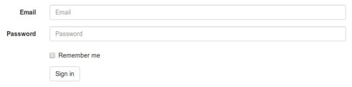

.. _`crispy tag forms`:

===========================
 tag with forms
===========================

django-crispy-forms implements a class called ``FormHelper`` that defines the form rendering behavior. Helpers give you a way to control form attributes and its layout, doing this in a programmatic way using Python. This way you write as little HTML as possible, and all your logic stays in the forms and views files.

Fundamentals
~~~~~~~~~~~~

For the rest of this document we will use the following example form for showing how to use a helper. This form is in charge of gathering some user information::

    class ExampleForm(forms.Form):
        like_website = forms.TypedChoiceField(
            label = "Do you like this website?",
            choices = ((1, "Yes"), (0, "No")),
            coerce = lambda x: bool(int(x)),
            widget = forms.RadioSelect,
            initial = '1',
            required = True,
        )

        favorite_food = forms.CharField(
            label = "What is your favorite food?",
            max_length = 80,
            required = True,
        )

        favorite_color = forms.CharField(
            label = "What is your favorite color?",
            max_length = 80,
            required = True,
        )

        favorite_number = forms.IntegerField(
            label = "Favorite number",
            required = False,
        )

        notes = forms.CharField(
            label = "Additional notes or feedback",
            required = False,
        )

Let's see how helpers works step by step, with some examples explained. First you will need to import ``FormHelper``::

    from crispy_forms.helper import FormHelper

Your helper can be a class level variable or an instance level variable, if you don't know what this means you might want to read the article "`Be careful how you use static variables in forms`_". As a rule of thumb, if you are not going to manipulate a `FormHelper` in your code, like in a view, you should be using a static helper, otherwise you should be using an instance level helper. If you still don't understand the subtle differences between both, use an instance level helper, because you won't end up suffering side effects. As in the next steps I will show you how to manipulate the form helper, so we will create an instance level helper. This is how you would do it::

    from crispy_forms.helper import FormHelper

    class ExampleForm(forms.Form):
        [...]
        def __init__(self, *args, **kwargs):
            super().__init__(*args, **kwargs)
            self.helper = FormHelper()

As you can see you need to call the base class constructor using ``super`` and override the constructor. This helper doesn't set any form attributes, so it's useless. Let's see how to set up some basic `FormHelper` attributes::

    from crispy_forms.helper import FormHelper
    from crispy_forms.layout import Submit

    class ExampleForm(forms.Form):
        [...]
        def __init__(self, *args, **kwargs):
            super().__init__(*args, **kwargs)
            self.helper = FormHelper()
            self.helper.form_id = 'id-exampleForm'
            self.helper.form_class = 'blueForms'
            self.helper.form_method = 'post'
            self.helper.form_action = 'submit_survey'

            self.helper.add_input(Submit('submit', 'Submit'))

Note that we are importing a class called ``Submit`` that is a layout object. We will see what layout objects are in detail later on, for now on let's just say that this adds a submit button to our form, so people can send their survey.

We've also done some helper magic. ``FormHelper`` has a list of attributes that can be set, that affect mainly form attributes. Our form will have as DOM id ``id-exampleForm``, it will have as DOM CSS class ``blueForms``, it will use http ``POST`` to send information and its action will be set to ``reverse(submit_survey)``.

Let's see how to render the form in a template. Supposing we have the form in the template context as ``example_form``, we would render it doing::

    
    

Notice that the ```` tags expects two parameters: first the form variable and then the helper. In this case we use the ``FormHelper`` attached to the form, but you could also create a ``FormHelper`` instance and pass it as a context variable. Most of the time, you will want to use the helper attached. Note that if you name your ``FormHelper`` attribute ``helper`` you will only need to do::

    

This is exactly the html that you would get::

    <form action="/submit/survey/" class="uniForm blueForms" method="post" id="id-exampleForm">
        

            <input type="hidden" name="csrfmiddlewaretoken" value="a643fab735d5ce6377ff456e73c4b1af" />
        

        <fieldset>
            <legend></legend>
            

                <label for="id_like_website" class="requiredField">¿Do you like this website?*</label>
                <ul>
                    <li><label for="id_like_website_0"><input checked="checked" name="like_website" value="1" id="id_like_website_0" type="radio" class="radioselect" /> Yes</label></li>
                    <li><label for="id_like_website_1"><input value="0" type="radio" class="radioselect" name="like_website" id="id_like_website_1" /> No</label></li>
                </ul>
            

            

                <label for="id_favorite_food" class="requiredField">What is you favorite food?*</label>
                <input id="id_favorite_food" class="textinput textInput" type="text" name="favorite_food" maxlength="80" required="required" />
            

            

                <label for="id_favorite_color" class="requiredField">What is you favorite color?*</label>
                <input id="id_favorite_color" class="textinput textInput" type="text" name="favorite_color" maxlength="80" required="required" />
            

            

                <label for="id_favorite_number">Favorite number</label>
                <input id="id_favorite_number" type="text" name="favorite_number" class="textinput textInput" />
            

            

                <label for="id_notes">Additional notes or feedback</label>
                <input id="id_notes" type="text" name="notes" class="textinput textInput" />
            

        </fieldset>
        

            <input type="submit" name="submit" value="Submit" class="submit submitButton" id="submit-id-submit" />
        

    </form>

What you'll get is the form rendered as HTML with awesome bits. Specifically...

 * Opening and closing form tags, with id, class, action and method set as in the helper::

    <form action="/submit/survey/" class="uniForm blueForms" method="post" id="id-exampleForm">
        [...]
    </form>

 * Django's CSRF controls::

    

        <input type="hidden" name="csrfmiddlewaretoken" value="a643fab735d5ce6377ff456e73c4b1af" />
    

 * Submit button::

    

        <input type="submit" name="submit" value="Submit" class="submit submitButton" id="submit-id-submit" />
    

.. _`Be careful how you use static variables in forms`: https://tothinkornottothink.com/post/7157151391/be-careful-how-you-use-static-variables-in-forms

Manipulating a helper in a view
~~~~~~~~~~~~~~~~~~~~~~~~~~~~~~~

Let's see how we could change any helper property in a view::

    @login_required()
    def inbox(request, template_name):
        example_form = ExampleForm()
        redirect_url = request.GET.get('next')

        # Form handling logic
        [...]

        if redirect_url is not None:
            example_form.helper.form_action = reverse('submit_survey') + '?next=' + redirectUrl

        return render_to_response(template_name, {'example_form': example_form}, context_instance=RequestContext(request))

We are changing ``form_action`` helper property in case the view was called with a ``next`` GET parameter.

Rendering several forms with helpers
~~~~~~~~~~~~~~~~~~~~~~~~~~~~~~~~~~~~

Often we get asked: "How do you render two or more forms, with their respective helpers, using ```` tag, without having ``<form>`` tags rendered twice?" Easy, you need to set ``form_tag`` helper property to ``False`` in every helper::

    self.helper.form_tag = False

Then you will have to write a little of html code surrounding the forms::

    <form action="" class="uniForm" method="post">
        
        
    </form>

You can read a list of :ref:`helper attributes` and what they are for.

Change '*' required fields
~~~~~~~~~~~~~~~~~~~~~~~~~~

If you don't like the use of ``*`` (asterisk) to denote required fields you have two options:

* Asterisks have an ``asteriskField`` class set. So you can hide it using CSS rule::

    .asteriskField {
        display: none;
    }

* Override ``field.html`` template with a custom one.

Make crispy-forms fail loud
~~~~~~~~~~~~~~~~~~~~~~~~~~~

By default when crispy-forms encounters errors, it fails silently, logs them and continues working if possible. A settings variable called ``CRISPY_FAIL_SILENTLY`` has been added so that you can control this behavior. If you want to raise exceptions instead of logging, telling you what’s going on when you are developing in debug mode, you can set it to::

    CRISPY_FAIL_SILENTLY = not DEBUG

Change crispy-forms <input> default classes
~~~~~~~~~~~~~~~~~~~~~~~~~~~~~~~~~~~~~~~~~~~

Django fields generate default classes, crispy-forms handles these and adds other classes for compatibility with CSS frameworks.

For example a ``CharField`` generates an ``<input class="textinput" ...``. But in uni form we need the class to be ``textInput`` (with capital 'I'), so crispy-forms leaves it like ``<input class="textinput textInput"...``. All official template packs are handled automatically, but maybe you are integrating a new CSS framework, or your company's custom one, with crispy-forms and need to change the default conversions. For this you need to use a settings variable called ``CRISPY_CLASS_CONVERTERS``, expected to be a Python dictionary::

    CRISPY_CLASS_CONVERTERS = {'textinput': "textinput inputtext"}

For example this setting would generate ``<input class"textinput inputtext" ...``. The key of the dictionary ``textinput`` is the Django's default class, the value is what you want it to be substituted with, in this case we are keeping ``textinput``.

Render a form within Python code
~~~~~~~~~~~~~~~~~~~~~~~~~~~~~~~~

Sometimes, it might be useful to render a form using crispy-forms within Python code, like a Django view, for that there is a nice helper ``render_crispy_form``. The prototype of the method is ``render_crispy_form(form, helper=None, context=None)``. You can use it like this. Remember to pass your CSRF token to the helper method using the context dictionary if you want the rendered form to be able to submit.

AJAX validation recipe
~~~~~~~~~~~~~~~~~~~~~~

You may wish to validate a crispy-form through AJAX to re-render any resulting form errors. One way to do this is to set 
up a view that validates the form and renders its html using ``render_crispy_form``. This html is then returned to the 
client AJAX request. Let's see an example.

Our server side code could be::

    from django.template.context_processors import csrf
    from crispy_forms.utils import render_crispy_form

    @json_view
    def save_example_form(request):
        form = ExampleForm(request.POST or None)
        if form.is_valid():
            # You could actually save through AJAX and return a success code here
            form.save()
            return {'success': True}

        ctx = {}
        ctx.update(csrf(request))
        form_html = render_crispy_form(form, context=ctx)
        return {'success': False, 'form_html': form_html}

I'm using a jsonview decorator from `django-jsonview`_.

Note that you have to provide ``render_crispy_form`` the necessary CSRF token, otherwise it will not work.

In our client side using jQuery would look like::

    var example_form = '#example-form';

    $.ajax({
        url: "",
        type: "POST",
        data: $(example_form).serialize(),
        success: function(data) {
            if (!(data['success'])) {
                // Here we replace the form, for the
                $(example_form).replaceWith(data['form_html']);
            }
            else {
                // Here you can show the user a success message or do whatever you need
                $(example_form).find('.success-message').show();
            }
        },
        error: function () {
            $(example_form).find('.error-message').show()
        }
    });

.. warning ::

    When replacing form html, you need to bind events using ``live`` or ``on`` jQuery method.

.. _`django-jsonview`: https://github.com/jsocol/django-jsonview

Bootstrap3 horizontal forms
~~~~~~~~~~~~~~~~~~~~~~~~~~~

The way you do horizontal forms in Bootstrap version 3 is setting some ``col-lg-X`` classes in labels and divs wrapping fields. This would mean a lot of hassle updating your layout objects for settings these classes, too much verbosity. Instead some ``FormHelper`` attributes have been added to help you easily achieve this. You will need to set only three attributes::

    helper.form_class = 'form-horizontal'
    helper.label_class = 'col-lg-2'
    helper.field_class = 'col-lg-8'
    helper.layout = Layout(
        'email',
        'password',
        'remember_me',
        StrictButton('Sign in', css_class='btn-default'),
    )

Of course you can set your widths as you like, it doesn't have to be exactly like this.

Bootstrap3 inline forms
~~~~~~~~~~~~~~~~~~~~~~~

The way you do inline forms in Bootstrap version 3 is::

    helper.form_class = 'form-inline'
    helper.field_template = 'bootstrap3/layout/inline_field.html'
    helper.layout = Layout(
        'email',
        'password',
        'remember_me',
        StrictButton('Sign in', css_class='btn-default'),
    )

Note: The `form-inline` class needs to be added to the form's `<form>` tag. Therefore let crispy-forms render the `<form>` tag or add the `form-inline` class manually to the `<form>` tag in your template. 

If you need to set attributes in a field, you have to use ``InlineField`` instead of ``Field``::

    from crispy_forms.bootstrap import InlineField

    helper.layout = Layout(
        InlineField('email', readonly=True),
        'password',
        [...]
    )

