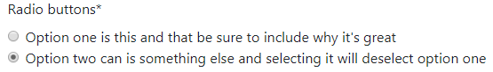
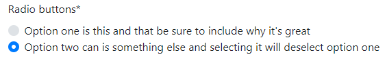
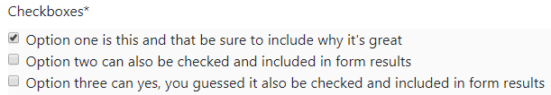
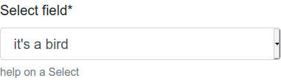
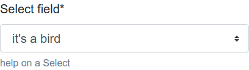
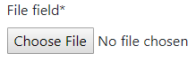
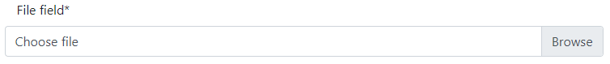

.. _`form helpers`:

==========
FormHelper
==========

What is a ``FormHelper`` and how to use it, is thoroughly explained in a previous section :ref:`crispy tag forms`.

.. _`helper form attached`:

FormHelper with a form attached (Default layout)
~~~~~~~~~~~~~~~~~~~~~~~~~~~~~~~~~~~~~~~~~~~~~~~~

Since version 1.2.0 ``FormHelper`` optionally can be passed an instance of a form. You would do it this way::

    from crispy_forms.helper import FormHelper

    class ExampleForm(forms.Form):
        def __init__(self, *args, **kwargs):
            super().__init__(*args, **kwargs)
            self.helper = FormHelper(self)

When you do this crispy-forms builds a default layout using ``form.fields`` for you, so you don't have to manually list them all if your form is huge. If you later need to manipulate some bits of a big layout, using dynamic layouts is highly recommended, check :ref:`dynamic layouts`.

Also, now the helper is able to cross match the layout with the form instance, being able to search by widget type if you are using dynamic API.

.. _`helper attributes`:

Helper attributes you can set
~~~~~~~~~~~~~~~~~~~~~~~~~~~~~

**template_pack**
    Allows you to set what template pack you want to use at ``FormHelper`` level. This is useful for example when a website needs to render different styling forms for different use cases, like desktop website vs smartphone website.

**template**
    When set allows you to render a form/formset using a custom template. Default template is at ``{{ TEMPLATE_PACK }}/[whole_uni_form.html|whole_uni_formset.html]``.

**field_template**
    When set allows you to render a form/formset using a custom field template. Default template is at ``{{ TEMPLATE_PACK }}/field.html``.

**form_method = ``POST``**
    Specifies form method attribute. You can see it to ``POST`` or ``GET``. Defaults to ``POST``.

**form_action**
    Applied to the form action attribute. Can be a named URL in your URLconf that can be executed via the  template tag. Example: ‘show_my_profile’. In your URLconf you could have something like::

        url(r'^show/profile/$', 'show_my_profile_view', name='show_my_profile')

    You can also point it to a URL ‘/whatever/blabla/’.

    Sometimes you may want to add arguments to the URL, for that you will have to do in your view::

        from django.urls import reverse
        form.helper.form_action = reverse('url_name', args=[event.id])
        form.helper.form_action = reverse('url_name', kwargs={'book_id': book.id})

**attrs**
    Added in 1.2.0, a dictionary to set any kind of form attributes. Underscores in keys are translated into hyphens. The recommended way when you need to set several form attributes in order to keep your helper tidy::

        ``{'id': 'form-id', 'data_id': '/whatever'}``
        <form id="form-id" data-id="/whatever" ...>

**form_id**
    Specifies form DOM id attribute. If no id provided then no id attribute is created on the form.

**form_class**
    String containing separated CSS classes to be applied to form class attribute. The form will always have by default ‘uniForm’ class.

**form_tag = True**
    It specifies if ``<form></form>`` tags should be rendered when using a Layout. If set to ``False`` it renders the form without the ``<form></form>`` tags. Defaults to ``True``.

**disable_csrf = False**
    Disable CSRF token, when done, crispy-forms won't use ```` tag. This is useful when rendering several forms using ```` tag and ``form_tag = False`` csrf_token gets rendered several times.

**form_error_title**
    If you are rendering a form using ```` tag and it has ``non_field_errors`` to display, they are rendered in a div. You can set the title of the div with this attribute. Example: “Form Errors”.

**formset_error_title**
    If you are rendering a formset using ```` tag and it has ``non_form_errors`` to display, they are rendered in a div. You can set the title of the div with this attribute. Example: “Formset Errors”.

**form_style = 'default'**
    Helper attribute for uni_form template pack. Uni-form has two different form styles built-in. You can choose which one to use, setting this variable to ``default`` or ``inline``.

**form_show_errors = True**
    Default set to ``True``. It decides whether to render or not form errors. If set to ``False``, form.errors will not be visible even if they happen. You have to manually render them customizing your template. This allows you to customize error output.

**render_unmentioned_fields = False**
    By default django-crispy-forms renders the layout specified if it exists strictly, which means it only renders what the layout mentions, unless your form has ``Meta.fields`` and ``Meta.exclude`` defined, in that case it uses them. If you want to render unmentioned fields (all form fields), for example if you are worried about forgetting mentioning them you have to set this property to ``True``. It defaults to ``False``.

**render_hidden_fields = False**
    By default django-crispy-forms renders the layout specified if it exists strictly. Sometimes you might be interested in rendering all form's hidden fields no matter if they are mentioned or not. Useful when trying to render forms with layouts as part of a formset with hidden primary key fields. It defaults to ``False``.

**render_required_fields = False**
    By default django-crispy-forms renders the layout specified if it exists strictly. Sometimes you might be interested in rendering all form's required fields no matter if they are mentioned or not. It defaults to ``False``.

**include_media = True**
    By default django-crispy-forms renders all form media for you within the form. If you want to render form media yourself manually outside the form, set this to ``False``. If you want to globally prevent rendering of form media, override the FormHelper class with this setting modified. It defaults to ``True``.

Bootstrap Helper attributes
~~~~~~~~~~~~~~~~~~~~~~~~~~~

There are currently some helper attributes that only have functionality for a specific template pack. This doesn't necessarily mean that they won't be supported for other template packs in the future.

**help_text_inline = False**
    Sets whether help texts should be rendered inline or block. If set to ``True`` help texts will be rendered using ``help-inline`` class, otherwise using ``help-block``. By default text messages are rendered in block mode.

**error_text_inline = True**
    Sets whether to render error messages inline or block. If set to ``True`` errors will be rendered using ``help-inline`` class, otherwise using ``help-block``. By default error messages are rendered in inline mode.

**html5_required = False**
    When set to ``True`` all required fields inputs will be rendered with HTML5 ``required=required`` attribute.

**form_show_labels = True**
    Default set to ``True``. Determines whether or not to render the form's field labels.

Bootstrap 3 Helper attributes
~~~~~~~~~~~~~~~~~~~~~~~~~~~~~

All previous, ``bootstrap`` (version 2) attributes are also settable in bootstrap 3 template pack ``FormHelpers``. Here are listed the ones, that are only available in ``bootstrap3`` template pack:

**label_class = ''**
    Default set to ``''``. This class will be applied to every label, this is very useful to do horizontal forms. Set it for example like this ``label_class = col-lg-2``.

**field_class = ''**
    Default set to ``''``. This class will be applied to every div ``controls`` wrapping a field. This is useful for doing horizontal forms. Set it for example like this ``field_class = col-lg-8``.

Bootstrap 4 Helper attributes
~~~~~~~~~~~~~~~~~~~~~~~~~~~~~

All previous, ``bootstrap`` (version 2 and 3) attributes are also settable in bootstrap 4 template pack ``FormHelpers``. Here are listed the ones, that are only available in ``bootstrap4`` template pack:

**use_custom_control = True**
    Enables the `optional UI customization <https://getbootstrap.com/docs/4.3/components/forms/#custom-forms>`_ of the template pack for radio, checkbox, select and file field. Useful when you already have customization based on the default interpretation of the template pack. Setting to ``False`` results in the `standard bootstrap <https://getbootstrap.com/docs/4.3/components/forms/#checkboxes-and-radios>`_ classes being applied for radio and checkbox, and Django rendering for file field. See table below for examples.
    
    The file field requires `additional JS <https://www.w3schools.com/bootstrap4/bootstrap_forms_custom.asp#myFile>`_ to enable its functionality, it is provided within the template pack as vanilla JS. 
    
    Defaults to ``True``.

.. |customcheckbox| image:: images/custom_checkbox.png
   :width: 300px
   :align: middle

+-----------------------+-----------------------+
|     Standard          |     Optional          |
+-----------------------+-----------------------+
|  |radio|              | |customradio|         |
+-----------------------+-----------------------+
|  |checkbox|           | |customcheckbox|      |
+-----------------------+-----------------------+
|  |select|             | |customselect|        |
+-----------------------+-----------------------+
|  |file|               | |customfile|          |
+-----------------------+-----------------------+

Custom Helper attributes
~~~~~~~~~~~~~~~~~~~~~~~~

Maybe you would like ``FormHelper`` to do some extra thing that is not currently supported or maybe you have a very specific use case. The good thing is that you can add extra attributes and crispy-forms will automatically inject them within template context. Let's see an example, to make things clear.

We want some forms to have uppercase labels, and for that we would like to set a helper attribute name ``labels_uppercase`` to ``True`` or ``False``. So we go and set in our helper::

    helper.labels_uppercase = True

What will happen is crispy-forms will inject a Django template variable named ``{{ labels_uppercase }}`` with its corresponding value within its templates, including ``field.html``, which is the template in charge of rendering a field when using crispy-forms. So we can go into that template and customize it. We will need to get familiar with it, but it's quite easy to follow; in the end it's just a Django template.

When we find where labels get rendered, this chunk of code to be more precise::

    
        <label for="{{ field.id_for_label }}" class="control-label requiredField">
            {{ field.label|safe }}*
        </label>
    

The line that we would change wold end up like this::

    {{ field.label|safe }}{{ field.label|safe|upper }}

Now we only need to override field template, for that you may want to check section :ref:`override templates`.

.. warning ::

    Be careful, depending on what you aim to do, sometimes using dynamic layouts is a better option, check section :ref:`dynamic layouts`.
