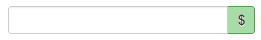
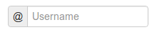
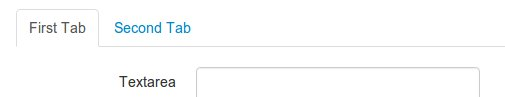
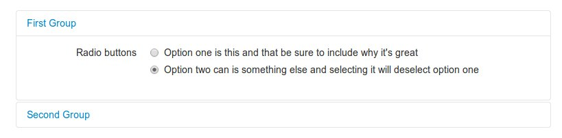
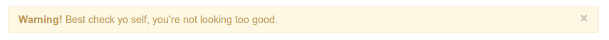

.. `layouts`:

=======
Layouts
=======

Fundamentals
~~~~~~~~~~~~

Django-crispy-forms defines another powerful class called ``Layout``, which allows you to change the way the form fields are rendered. This allows you to set the order of the fields, wrap them in divs or other structures, add html, set ids, classes or attributes to whatever you want, etc. And all that without writing a custom form template, using programmatic layouts. Just attach the layout to a helper, layouts are optional, but probably the most powerful thing django-crispy-forms has to offer.

A ``Layout`` is constructed by layout objects, which can be thought of as form components.

All these components are explained later in :ref:`layout objects`, what you need to know now about them is that every component renders a different template and has a different purpose. Let’s write a couple of different layouts for our form, continuing with our form class example (note that the full form is not shown again).

Some layout objects are specific to a template pack. For example ``ButtonHolder`` is for ``uni_form`` template_pack, while ``FormActions`` is for ``bootstrap`` template pack.

Let's add a layout to our helper::

    from crispy_forms.helper import FormHelper
    from crispy_forms.layout import Layout, Fieldset, ButtonHolder, Submit

    class ExampleForm(forms.Form):
        [...]
        def __init__(self, *args, **kwargs):
            super(ExampleForm, self).__init__(*args, **kwargs)
            self.helper = FormHelper()
            self.helper.layout = Layout(
                Fieldset(
                    'first arg is the legend of the fieldset',
                    'like_website',
                    'favorite_number',
                    'favorite_color',
                    'favorite_food',
                    'notes'
                ),
                ButtonHolder(
                    Submit('submit', 'Submit', css_class='button white')
                )
            )

When we render the form now using::

    
    

We will get the fields wrapped in a fieldset, whose legend will be set to 'first arg is the legend of the fieldset'. The fields' order will be: ``like_website``, ``favorite_number``, ``favorite_color``, ``favorite_food`` and ``notes``. We also get a submit button wrapped in a ``
`` which uni-form CSS positions in a nice way. That button has its CSS class set to ``button white``.

This is just the tip of the iceberg: now imagine you want to add an explanation for what notes are, you can use ``HTML`` layout object::

    Layout(
        Fieldset(
            'Tell us your favorite stuff {{ username }}',
            'like_website',
            'favorite_number',
            'favorite_color',
            'favorite_food',
            HTML("""
                
We use notes to get better, <strong>please help us {{ username }}</strong>

            """),
            'notes'
        )
    )

As you'll notice the fieldset legend is context aware and you can write it as if it were a chunk of a template where the form will be rendered. The ``HTML`` object will add a message before the notes input and it's also context aware. Note how you can wrap layout objects into other layout objects. Layout objects ``Fieldset``, ``Div``, ``MultiField`` and ``ButtonHolder`` can hold other Layout objects within. Let's do an alternative layout for the same form::

    Layout(
        MultiField(
            'Tell us your favorite stuff {{ username }}',
            Div(
                'like_website',
                'favorite_number',
                css_id = 'special-fields'
            ),
            'favorite_color',
            'favorite_food',
            'notes'
        )
    )

This time we are using a ``MultiField``, which is a layout object that as a general rule can be used in the same places as ``Fieldset``. The main difference is that this renders all the fields wrapped in a div and when there are errors in the form submission, they are shown in a list instead of each one surrounding the field. Sometimes the best way to see what layout objects do, is just try them and play with them a little bit.

Layout objects attributes
~~~~~~~~~~~~~~~~~~~~~~~~~

All layout objects you can set kwargs that will be used as HTML attributes. For example if you want to turn autocomplete off for a field you can do::

    Field('field_name', autocomplete='off')

If you want to set html attributes, with words separated by hyphens like ``data-name``, as Python doesn't support hyphens in keyword arguments and hyphens are the usual notation in HTML, underscores will be translated into hyphens, so you would do::

    Field('field_name', data_name="whatever")

As ``class`` is a reserved keyword in Python, for it you will have to use ``css_class``. For example::

    Field('field_name', css_class="black-fields")

And id attribute is set using ``css_id``::

    Field('field_name', css_id="custom_field_id")

.. _`layout objects`:

Universal layout objects
~~~~~~~~~~~~~~~~~~~~~~~~

These ones live in module ``crispy_forms.layout``. These are layout objects that are not specific to a template pack. We'll go one by one, showing usage examples:

- **Div**: It wraps fields in a ``
``::

    Div('form_field_1', 'form_field_2', 'form_field_3', ...)

**NOTE** Mainly in all layout objects you can set kwargs that will be used as HTML attributes. As ``class`` is a reserved keyword in Python, for it you will have to use ``css_class``. For example::

    Div('form_field_1', style="background: white;", title="Explication title", css_class="bigdivs")

- **HTML**: A very powerful layout object. Use it to render pure html code. In fact it behaves as a Django template and it has access to the whole context of the page where the form is being rendered. This layout object doesn't accept any extra parameters than the html to render, you cannot set html attributes like in ``Div``::

    HTML(" 
Operation was successful
 ")

 .. warning ::

    Beware that this is rendered in a standalone template, so if you are using custom templatetags or filters, don't forget to add your ````

- **Field**: Extremely useful layout object. You can use it to set attributes in a field or render a specific field with a custom template. This way you avoid having to explicitly override the field's widget and pass an ugly ``attrs`` dictionary::

    Field('password', id="password-field", css_class="passwordfields", title="Explanation")
    Field('slider', template="custom-slider.html")

This layout object can be used to easily extend Django's widgets. If you want to render a Django form field as hidden you can simply do::

    Field('field_name', type="hidden")

If you need HTML5 attributes, you can easily do those using underscores ``data_name`` kwarg here will become into ``data-name`` in your generated html::

    Field('field_name', data_name="special")

Fields in bootstrap are wrapped in a ``
``. You may want to set extra classes in this div, for that do::

    Field('field_name', wrapper_class="extra-class")

- **Submit**: Used to create a submit button. First parameter is the ``name`` attribute of the button, second parameter is the ``value`` attribute::

    Submit('search', 'SEARCH')
    Submit('search', 'SEARCH')

Renders to::

    <input type="submit" name="search" value="SEARCH" class="submit submitButton" id="submit-id-search" />

- **Hidden**: Used to create a hidden input::

    Hidden('name', 'value')

- **Button**: Creates a button::

    Button('name', 'value')

- **Reset**: Used to create a reset input::

    reset = Reset('name', 'value')

- **Fieldset**: It wraps fields in a ``<fieldset>``. The first parameter is the text for the fieldset legend, as we've said it behaves like a Django template::

    Fieldset("Text for the legend {{ username }}",
        'form_field_1',
        'form_field_2'
    )

Uni-form layout objects
~~~~~~~~~~~~~~~~~~~~~~~

These ones live in module ``crispy_forms.layout``. Probably in the future they will be moved out to a ``uni_form`` module:

- **ButtonHolder**: It wraps fields in a ``
``, which uni-form positions in a nice way. This is where form's submit buttons go in uni-form::

    ButtonHolder(
        HTML("✓ Saved data"),
        Submit('save', 'Save')
    )

- **MultiField**: It wraps fields in a ``
`` with a label on top. When there are errors in the form submission it renders them in a list instead of each one surrounding the field::

    MultiField("Text for the label {{ username }}",
        'form_field_1',
        'form_field_2'
    )

Bootstrap Layout objects
~~~~~~~~~~~~~~~~~~~~~~~~

These ones live under module ``crispy_forms.bootstrap``.

- **FormActions**: It wraps fields in a ``
``. It is usually used to wrap form's buttons::

    FormActions(
        Submit('save', 'Save changes'),
        Button('cancel', 'Cancel')
    )

- **AppendedText**: It renders a bootstrap appended text input. The first parameter is the name of the field to add appended text to, then the appended text which can be HTML like. There is an optional parameter ``active``, by default set to ``False``, that you can set to a boolean to render appended text active::

    AppendedText('field_name', 'appended text to show')
    AppendedText('field_name', '$', active=True)

- **PrependedText**: It renders a bootstrap prepended text input. The first parameter is the name of the field to add prepended text to, then the prepended text which can be HTML like. There is an optional parameter ``active``, by default set to ``False``, that you can set to a boolean to render prepended text active::

    PrependedText('field_name', '<b>Prepended text</b> to show')
    PrependedText('field_name', '@', placeholder="username")

- **PrependedAppendedText**: It renders a combined prepended and appended text. The first parameter is the name of the field, then the prepended text and finally the appended text::

    PrependedAppendedText('field_name', '$', '.00'),

- **InlineCheckboxes**: It renders a Django ``forms.MultipleChoiceField`` field using inline checkboxes::

    InlineCheckboxes('field_name')

- **InlineRadios**: It renders a Django ``forms.ChoiceField`` field with its widget set to ``forms.RadioSelect`` using inline radio buttons::

    InlineRadios('field_name')

- **StrictButton**: It renders a button using ``<button>`` html, not ``input``. By default ``type`` is set to ``button`` and ``class`` is set to ``btn``::

    StrictButton('Button's content', name="go", value="go", css_class="extra")
    StrictButton('Success', css_class="btn-success")

- **FieldWithButtons**: You can create an input connected with buttons::

    FieldWithButtons('field_name', StrictButton("Go!"))

- **Tab & TabHolder**: ``Tab`` renders a tab, different tabs need to be wrapped in a ``TabHolder`` for automatic javascript functioning, also you will need ``bootstrap-tab.js`` included in your static files::

    TabHolder(
        Tab('First Tab',
            'field_name_1',
            Div('field_name_2')
        ),
        Tab('Second Tab',
            Field('field_name_3', css_class="extra")
        )
    )

- **Accordion & AccordionGroup**: ``AccordionGroup`` renders an accordion pane, different groups need to be wrapped in an ``Accordion`` for automatic javascript functioning, also you will need ``bootstrap-tab.js`` included in your static files::

    Accordion(
        AccordionGroup('First Group',
            'radio_buttons'
        ),
        Tab('Second Group',
            Field('field_name_3', css_class="extra")
        )
    )

- **Alert**: ``Alert`` generates markup in the form of an alert dialog::

    Alert(content='<strong>Warning!</strong> Best check yo self, you're not looking too good.')

.. _`override templates`:

Overriding layout objects templates
~~~~~~~~~~~~~~~~~~~~~~~~~~~~~~~~~~~

The mentioned set of :ref:`layout objects` has been thoroughly designed to be flexible, standard compatible and support Django form features. Every Layout object is associated to a different template that lives in ``templates/{{ TEMPLATE_PACK_NAME }}/layout/`` directory.

Some advanced users may want to use their own templates, to adapt the layout objects to their use or necessities. There are three ways to override the template that a layout object uses.

- **Globally**: You override the template of the layout object, for all instances of that layout object you use::

    from crispy_forms.layout import Div
    Div.template = 'my_div_template.html'

- **Individually**: You can override the template for a specific layout object in a layout::

    Layout(
        Div(
            'field1',
            'field2',
            template='my_div_template.html'
        )
    )

- **Overriding templates directory**: This means mimicking crispy-forms directory structure into your project and then copying the templates that you want to override there, finally editing those copies. If you are using this approach it's better to just copy and edit templates you will customize instead of all.

Overriding project templates
~~~~~~~~~~~~~~~~~~~~~~~~~~~~

You need to differentiate between layout objects' templates and django-crispy-forms templates. There are some templates that live in ``templates/{{ TEMPLATE_PACK_NAME }}`` that define the form/formset structure, how a field or errors are rendered, etc. They add very little logic and are pretty much basic wrappers for the rest of django-crispy-forms power. To override these ones you have two options:

- **template** and **field_template** attributes in ``FormHelper``: Since version 1.3.0 you can override the form/formset template and the field template using helper attributes, see section :ref:`helper attributes`. With this you can change one specific form or all your project forms (creating a custom FormHelper base class for example).

- **Overriding templates directory**: This works the same as explained in section :ref:`override templates`. If you are adapting crispy-forms templates to a popular open source template pack you use, submit it so more people can benefit from it.

- **Creating a TEMPLATE PACK**: You maybe want to use crispy-forms with you favorite CSS framework or your Company's CSS. For doing so, you will need to be quite familiar with crispy-forms, layout objects and their templates. You will probably want to start off with one of the existing template packs, probably ``bootstrap``. Imagine your template pack is named ``chocolate``, that means you probably want your root directory named the same way. For using your template pack, you will have to set ``CRISPY_TEMPLATE_PACK = 'chocolate'`` variable in your settings file and also set ``CRISPY_ALLOWED_TEMPLATE_PACKS = ('bootstrap', 'chocolate')``. This way crispy-forms will know you want to use your own template pack, which is an allowed one and where to look for it.

.. _`django-uni-form-contrib`: https://github.com/kennethlove/django-uni-form-contrib
.. _`Bootstrap`: https://github.com/twitter/bootstrap

Creating your own layout objects
~~~~~~~~~~~~~~~~~~~~~~~~~~~~~~~~

The :ref:`layout objects` bundled with django-crispy-forms are a set of the most seen components that build a form. You will probably be able to do anything you need combining them. Anyway, you may want to create your own components, for doing that, you will need a good grasp of django-crispy-forms. Every layout object must have a method called ``render``. Its prototype should be::

    def render(self, form, form_style, context):

The official layout objects live in ``layout.py`` and ``bootstrap.py``, you may want to have a look at them to fully understand how to proceed. But in general terms, a layout object is a template rendered with some parameters passed.

If you come up with a good idea and design a layout object you think others could benefit from, please open an issue or send a pull request, so django-crispy-forms gets better.

Composing layouts
~~~~~~~~~~~~~~~~~

Imagine you have several forms that share a big chunk of the same layout. There is a easy way you can create a ``Layout``, reuse and extend it. You can have a ``Layout`` as a component of another ``Layout``. You can build that common chunk, different ways. As a separate class::

    class CommonLayout(Layout):
        def __init__(self, *args, **kwargs):
            super(CommonLayout, self).__init__(
                MultiField("User data",
                    'username',
                    'lastname',
                    'age'
                )
            )

Maybe an object instance is good enough::

    common_layout = Layout(
        MultiField("User data",
            'username',
            'lastname',
            'age'
        )
    )

Then you can do::

    helper.layout = Layout(
        CommonLayout(),
        Div(
            'favorite_food',
            'favorite_bread',
            css_id = 'favorite-stuff'
        )
    )

Or::

    helper.layout = Layout(
        common_layout,
        Div(
            'professional_interests',
            'job_description',
        )
    )

We have defined a layout and used it as a chunk of another layout, which means that those two layouts will start the same way and then extend the layout in different ways.
